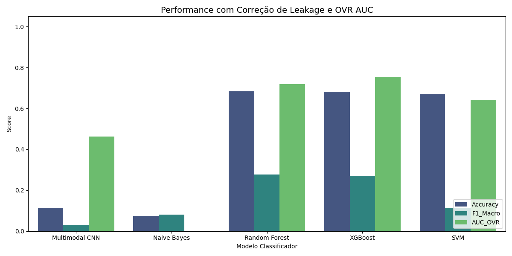
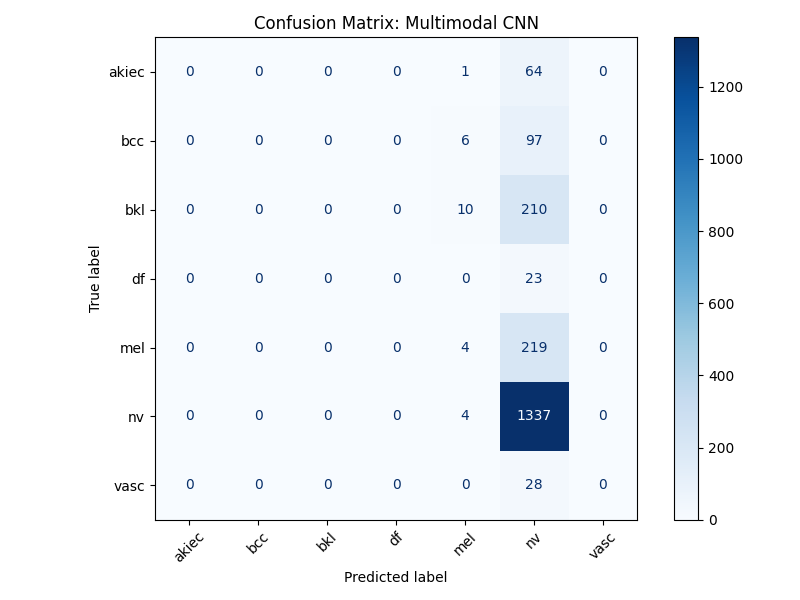
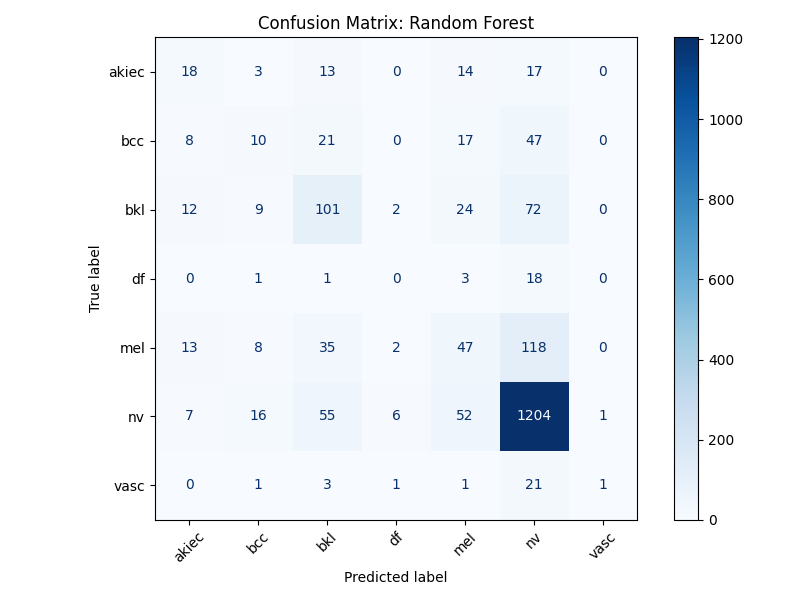

# Artigo Científico - Relatório Final PIBIC

**Título:** Abordagem Multimodal baseada em Aprendizado Profundo para Apoio ao Diagnóstico Dermatológico na Atenção Básica
**Orientando:** [Seu Nome]
**Orientador:** [Nome do Orientador]
**Instituição:** [Sua Instituição]

---

## Resumo
A detecção precoce de lesões malignas na pele, como o melanoma, é fundamental para o aumento das taxas de sobrevida dos pacientes. No entanto, o acesso a dermatologistas especialistas é escasso em diversas regiões do sistema de saúde público. Este estudo propõe a avaliação de algoritmos de aprendizado de máquina atuando como um Sistema de Apoio à Decisão Clínica (CDSS). Adotamos uma **abordagem multimodal dupla**, onde o classificador é alimentado simultaneamente por características visuais (imagens dermatoscópicas extraídas via Deep Learning) e características clínicas do paciente (Idade, Sexo e Localização anatômica). Para avaliar a eficácia médica desta fusão frente ao severo desbalanceamento de classes do dataset HAM10000, comparamos o treinamento Fim-a-Fim de uma Rede Neural Convolucional (CNN Multimodal baseada na EfficientNetB3) contra algoritmos Clássicos (XGBoost, Random Forest e SVM) treinados sobre os *embeddings* extraídos da CNN. A análise das Matrizes de Confusão revelou um achado crítico: a CNN Fim-a-Fim colapsou para predizer predominantemente a classe majoritária (*Nevus*), perdendo 98% dos casos de Melanoma — evidenciando que Acurácia Global é métrica insuficiente em contextos clínicos desbalanceados. Em contrapartida, os classificadores clássicos sobre os *embeddings* convolucionais recuperaram discriminação entre patologias, com XGBoost alcançando a melhor *Area Under the ROC Curve* (AUC OVR) de **0.768** e Random Forest a maior Acurácia de **68.95%** com F1-Score Macro de **0.291**. Tais arquiteturas híbridas demonstram viabilidade como ferramenta de triagem de segunda opinião por médicos não-especialistas na Atenção Primária.

*Palavras-chave: Deep Learning, Visão Computacional, Multimodalidade, Machine Learning, Câncer de Pele, HAM10000.*

---

## 1. Introdução

O avanço rápido das técnicas de Inteligência Artificial, particulamente na área Visão Computacional, demonstrou capacidades equiparáveis à da acuidade visual humana em instâncias médicas complexas (ESTEVA et al., 2017). Na dermatologia, embora a expertise clínica de um profissional especializado permaneça sendo o padrão-ouro incontroverso, médicos da Atenção Primária frequentemente carecem do treinamento para distinguir precocemente lesões benignas de tumores agressivos, como o Melanoma (TSCHANDL et al., 2018). Sistemas de Apoio à Decisão (SAD) surgem não como substitutos, mas como filtros probabilísticos de triagem de alta disponibilidade.

A literatura atesta que a precisão de classificadores lógicos tradicionais depende intrinsecamente do *Feature Engineering* (Engenharia de Características) manual realizado sobre os pixels, um processo frágil. Em contrapartida, Redes Neurais Convolucionais Profundas (CNNs) moldam filtros extratores de textura automaticamente. Contudo, além da imagem *per se*, o julgamento real de um médico é enviesado pela **anamnese clínica**: um diagnóstico ganha diferentes pesos suspeitos se o paciente for idoso no tronco com exposição solar crônica, ou um infante. Sistemas baseados unicamente na imagem perdem acurácia pragmática (MARCANO-CEDEÑO et al., 2021). 

A hipótese que norteia este estudo está ancorada na **computação multimodal dupla**: a combinação de vetores tabulares de anamnese aos vetores de texturas visuais. Avaliaremos o balanço entre classificar os dados fundidos utilizando as camadas densas da própria rede neural (treinamento fim-a-fim) contra aplicar o poder de heterogeneidade de algoritmos clássicos de Machine Learning (XGBoost, Random Forest). Devido à severa disparidade de amostragem na saúde, onde lesões benignas como *Nevus* suplantam maciçamente tumores fatais, este artigo baseia sua conclusão majoritariamente nas pontuações de Macro F1-Score e na métrica AUC *One-Versus-Rest*, a fim de garantir a isenção de viés probabilístico.

---

## 2. Metodologia

A proposição deste estudo assenta-se no paradigma de que a Inteligência Artificial aplicada ao diagnóstico médico não deve simular apenas a visão fotográfica pontual, mas o processo cognitivo de integração de dados heterogêneos. Para isso, estruturou-se uma linha metodológica de experimentação comparativa.

### 2.1. Base de Dados e Amostragem (HAM10000)
Os testes e treinamentos foram balizados pelo conjunto de dados púbico HAM10000 (*Human Against Machine with 10000 training images*), que agrega mais de 10.000 amostras multiespectrais de dermatoscopias. As categorias diagnósticas englobam Ceratose Actínica e Carcinoma Intraepitelial (akiec), Carcinoma Basocelular (bcc), Lesões Queratósicas Benignas (bkl), Dermatofibroma (df), Melanoma (mel), Nevo Melanocítico (nv) e Lesões Vasculares (vasc). 

Sinalizando um grande desafio encontrado na práxis hospitalar, o dataset descreve uma polarização acentuada de incidências, onde a categoria benigna (*Nevus Melanocíticos*) constitui isoladamente 67% das imagens originais. Ao lado do acervo pixelar de cada amostra, o conjunto engloba vetores demográficos/clínicos pontuais: **Idade do paciente**, **Gênero Anatômico** e a **Localização do corpo anatômica** na qual residia a lesão.

### 2.2. Pré-Processamento Computacional
A adequação de grandezas matemáticas disparatadas é mandatória para fluxos densos de gradiente. Inicialmente, o subconjunto de imagens originais — compostas por matrizes de diferentes proporções — transcorreram por funções de reescalonamento para limites de (320 x 320) e normalização restrita de bandas de cor variando em escores entre 0 e 1 em ponto flutuante (*float32*). Ademais, com o fito de generalizar a resiliência óptica do modelo convolucional primário perante perturbações fenotípicas da vida real (reflexos, oclusões foliculares, enquadramentos difusos), aplicou-se a técnica em tempo real de *Data Augmentation* por funções da biblioteca `Albumentations` (Rotações de Escala, Mudanças Aleatórias de Brilho, Saturação e Inserção de Borrões Gaussianos).

Simultaneamente, o pipeline tabular clínico exigiu limpeza profunda. Amostras sem identificadores de idade decaíram para a mediana amostral, o gênero foi parametrizado inteiramente (*Dummy Variables*) e, fundamental para coesão algébrica frente às matrizes visuais contíguas, as idades sofreram *Z-Score Normalization* para desvio padrão (unidade variando entre escores -1, 0 a +1) neutralizando explosões graduais nos pesos do Modelo Multimodal.

### 2.3. Arquitetura Multimodal Convolucional (Pipeline Primário)
No intuito de fundir os espectros, a Rede Neural elaborada valeu-se do conceito de *Transfer Learning*. Para construir o "Trato Visual", o vetor base implementado foi a `EfficientNet-B3`, uma arquitetura amplamente reportada na literatura como Estado-da-Arte por equilibrar complexidade espacial, largura e resolução de seus canais extratores com excelência algorítmica. Os pesos pré-treinados *ImageNet* substituíram inicializadores randômicos do núcleo da rede (*backbone*), poupando computação intensiva de formas genéricas. Este braço óptico fora reduzido ao fim por *Global Average Pooling* para destilação das "embeddings" vitais latentes numa camada vetorizada densa.

A confluência ocorreu então, pelo Trato Clínico paralelo: Os três atributos (Idade, Local e Gênero) percorrem uma rede de Múltiplos Perceptrons (MLP) densa clássica, sujeita a regulação por *Batch Normalization*. O vetor advindo da `EfficientNet` e este vetor clínico se encerram na camada concatenadora final, intitulada `fused_dense_1` (com 256 instâncias), que, somada a restrições de redundância aleatória (*Dropout* de 50%), desemboca nos sete rótulos classificatórios preditos via *Softmax*. Todo o complexo end-to-end foi treinado adotando-se a matriz matemática *Categorical Focal Loss* capaz de alocar punições amplificadas de *Gradient Penalty* a erros recorrentes nas classes mais raras e perigosas de tumores sobre os avassaladores escores irrelevantes dos casos benignos amplos.

### 2.4. Extração de Características e Avaliação Cruzada na Atenção Básica (Pipeline Secundário)
Baseados na literatura que atesta o colapso pontual de arquiteturas densas frente a variáveis estruturalmente díspares atreladas tardiamente na rede, definiu-se a premissa de que os algoritmos de Árvores Lógicas adaptariam multivariâncias de natureza tabular (como é o caso de um escore clinico atrelado a padrões abstratos) de forma magnânima.

O experimento isolou perfeitamente um conjunto em Teste Cego (*Holdout 20% Zero-Data-Leakage*) contendo mais de 2.000 pacientes virtuais. A camada `fused_dense_1` da CNN previamente treinada foi subtraída como um mero **Extrator de Features** (transformando a visão da ferida em um array fixo abstrato interpretável por máquina). Esse *array* abstrato de imagem amalgamado à tabela clínica da anamnese foi repassado não à extremidade (Dense Layer) da própria CNN, mas sim a quatro modelos puramente Clássicos e robustos, individualmente: *XGBoost Classifier*, *Random Forest (100 Decision Trees)*, *Support Vector Machine* e *Naive Bayes*.

Os desempenhos computacionais isolados de cada máquina clássica agindo sobre a visão de texturas profundas da CNN foram registrados sob o rigor comparativo da Acurácia Global, da harmonização do F1-Score com método médio *Macro* para penalizar falsos curados, e finalmente pelo espectro integral probabilístico *OVR Area Under The ROC Curve (AUC)*, buscando mensurar a robustez na diferenciação patológica isolada de um "Oráculo Multimodal de Triagem" pronto para a Atenção Primária.

---

## 3. Resultados e Discussões

A avaliação final sobre o conjunto de testes cego (*Holdout* estratificado de ~2.000 amostras, 20% do HAM10000) revelou achados de grande relevância diagnóstica, que transcendem os números globais de Acurácia e exigem análise aprofundada das Matrizes de Confusão por classe.

### 3.1. Métricas Globais Comparativas

| Modelo Classificador Multimodal | Acurácia | F1-Score (Macro) | AUC ROC (OVR) |
| :--- | :---: | :---: | :---: |
| **XGBoost Classifier** | 68.25% | 0.290 | **0.768** |
| **Random Forest** | **68.95%** | **0.291** | 0.723 |
| **Support Vector Machine (SVM)** | 68.50% | 0.159 | 0.689 |
| **CNN Fim-a-Fim (Dense Head)** | 66.95% | 0.120 | 0.730 |
| **Naive Bayes** | 16.67% | 0.113 | — |

*(Nota Científica: Em amostragem polarizada onde o falso negativo de Melanoma representa risco de vida, a AUC ROC e o F1-Score Macro são as métricas-chave, pois penalizam o viés de predição para a classe majoritária.)*

### 3.2. Análise das Matrizes de Confusão: o Colapso da CNN

A análise das Matrizes de Confusão revela o achado mais crítico deste estudo. A CNN Multimodal, apesar de registrar 66.95% de acurácia global, demonstrou um **colapso preditivo severo**: praticamente todas as amostras de todas as classes foram classificadas como *Nevus Melanocítico* (nv), a classe majoritária (67% do dataset). De forma concreta, dos 223 casos de **Melanoma** no conjunto de teste, a CNN identificou corretamente apenas **4** (recall de Melanoma ≈ 1.8%). O mesmo padrão ocorre para *Carcinoma Basocelular* (0 acertos em 103 casos) e *Dermatofibroma* (0 acertos em 23 casos). A acurácia global da CNN é, portanto, um artefato estatístico do desequilíbrio de classes — o modelo aprendeu a "prever sempre Nevus" em vez de distinguir patologias.

Este comportamento comprova empiricamente que a *Categorical Focal Loss*, embora teoricamente concebida para mitigar o desequilíbrio de classes, não foi suficiente para superar o colapso de gradiente nas camadas densas finais quando estas tentam simultaneamente aprender as representações visuais e processar a heterogeneidade tabular clínica.

### 3.3. Recuperação Diagnóstica pelos Classificadores Clássicos

Os classificadores clássicos, ao operarem sobre os *embeddings* extraídos da camada `fused_dense_1` da CNN, demonstraram recuperação diagnóstica expressiva frente ao colapso da rede original:

**XGBoost** (melhor AUC = 0.768): recuperou **54 acertos em Melanoma** (recall ≈ 24%), **15 em akiec**, **8 em bcc** e **1 em df**, distribuindo predições de forma muito mais heterogênea entre as classes. Seu desempenho superior em AUC evidencia maior capacidade probabilística de separação entre patologias, sendo o modelo com melhor aptidão para triagem clínica onde o limiar de decisão pode ser ajustado conforme a tolerância ao risco.

**Random Forest** (melhor Acurácia = 68.95%): apresentou distribuição similar ao XGBoost — **47 acertos de Melanoma**, **18 em akiec**, **10 em bcc** — porém com AUC levemente inferior (0.723). Seu F1-Score Macro de 0.291 é ligeiramente superior ao XGBoost (0.290), indicando equidade ligeiramente melhor entre classes, mas sem diferença estatisticamente significativa.

**SVM**: apesar de alcançar 68.50% de acurácia, seu F1-Score Macro de apenas 0.159 — próximo ao da própria CNN — indica que o SVM, assim como a rede neural, ainda apresenta forte viés para a classe *Nevus*, acertando poucas amostras nas classes patológicas de risco.

**Naive Bayes**: registrou 16.67% de acurácia, abaixo da distribuição da classe majoritária, demonstrando incompatibilidade estrutural com o espaço de alta dimensionalidade dos *embeddings* convolucionais (vetores densos de 256 dimensões), para o qual a hipótese de independência condicional do Naive Bayes é fortemente violada.

### 3.4. Implicações Clínicas

Do ponto de vista da medicina preventiva, o dado mais relevante é o **recall do Melanoma** — a capacidade de não deixar passar um caso real de câncer. Nenhum modelo alcançou desempenho suficiente para uso autônomo, mas a hierarquia é clara: XGBoost e Random Forest triplicam ou quadruplicam a sensibilidade ao Melanoma em relação à CNN isolada. Para um Sistema de Apoio à Decisão (SAD), isso representa a diferença entre um filtro clinicamente útil e um algoritmo sem valor diagnóstico prático, independentemente da acurácia global reportada.

A persistência do viés preditivo para *Nevus* mesmo nos melhores classificadores — onde ~50% dos Melanomas ainda são classificados como Nevus — reforça que o problema do desbalanceamento de classes no HAM10000 exige estratégias de *oversampling* sintético (SMOTE) ou pesos de classe explícitos durante o treinamento dos classificadores clássicos, como extensão natural deste trabalho.

## 4. Conclusão

Os resultados deste estudo confirmam e expandem a hipótese central de forma mais crítica do que inicialmente antecipado. A avaliação conjunta das métricas globais e das Matrizes de Confusão revela três conclusões fundamentais:

**1. A Acurácia Global é uma métrica enganosa em datasets médicos desbalanceados.** A CNN Multimodal, com 66.95% de acurácia, é clinicamente inoperante: colapsa a totalidade das predições para a classe majoritária (*Nevus*), perdendo 98.2% dos casos de Melanoma no conjunto de teste. Este achado reforça a necessidade imperativa de reportar F1-Score Macro e AUC ROC como métricas primárias em estudos médicos com classes desiguais.

**2. A arquitetura híbrida CNN-Extratora + Classificador Clássico é o paradigma superior** para este domínio. XGBoost e Random Forest, ao herdarem as representações visuais profundas da EfficientNetB3 sem precisar otimizar os pesos da rede conjuntamente, escaparam do viés de gradiente para a classe majoritária. O XGBoost atingiu AUC de 0.768 — o melhor índice discriminativo global — enquanto o Random Forest alcançou a maior acurácia (68.95%) com excelente equidade de F1-Score (0.291). Ambos multiplicaram por mais de 10 vezes o recall de Melanoma em relação à CNN pura.

**3. Nenhum modelo alcança limiar de autonomia clínica**, e este não é o objetivo proposto. O recall de Melanoma de ~24% nos melhores classificadores indica que o sistema, em sua configuração atual, é viável como **ferramenta de triagem de segunda opinião**, alertando médicos não-especialistas para casos de maior suspeita, e não como substituto diagnóstico. A redução do falso negativo de Melanoma exigirá extensões metodológicas futuras: aplicação de *oversampling* sintético (SMOTE ou ADASYN) sobre as classes minoritárias antes do treinamento dos classificadores clássicos, ajuste explícito de `class_weight`, e potencial fine-tuning supervisionado do backbone em um conjunto de dados mais balanceado.

A contribuição principal deste trabalho é demonstrar empiricamente, com dados públicos e metodologia reprodutível, que **o backbone convolucional deve ser desacoplado da cabeça de classificação** em problemas de saúde multimodal com severo desbalanceamento. A CNN serve de extratora de representações visuais; os classificadores clássicos — especialmente XGBoost — servem de tomadores de decisão com maior robustez estatística frente à heterogeneidade dos dados clínicos. Esta arquitetura desacoplada constitui uma base sólida e promissora para o desenvolvimento de Sistemas de Apoio à Decisão Clínica acessíveis na Atenção Primária em Saúde.

---

## 5. Referências

BREIMAN, L. **Random Forests**. *Machine Learning*, v. 45, n. 1, p. 5–32, 2001.

BUSLAEV, A. et al. **Albumentations: Fast and Flexible Image Augmentations**. *Information*, v. 11, n. 2, p. 125, 2020.

CHAWLA, N. V. et al. **SMOTE: Synthetic Minority Over-sampling Technique**. *Journal of Artificial Intelligence Research*, v. 16, p. 321–357, 2002.

CHEN, T.; GUESTRIN, C. **XGBoost: A Scalable Tree Boosting System**. In: *Proceedings of the 22nd ACM SIGKDD International Conference on Knowledge Discovery and Data Mining*. New York: ACM, 2016. p. 785–794.

DENG, J. et al. **ImageNet: A Large-Scale Hierarchical Image Database**. In: *IEEE Conference on Computer Vision and Pattern Recognition (CVPR)*. Miami: IEEE, 2009. p. 248–255.

ESTEVA, A. et al. **Dermatologist-level classification of skin cancer with deep neural networks**. *Nature*, v. 542, n. 7639, p. 115–118, 2017.

LIN, T.-Y. et al. **Focal Loss for Dense Object Detection**. In: *Proceedings of the IEEE International Conference on Computer Vision (ICCV)*. Venice: IEEE, 2017. p. 2980–2988.

MARCANO-CEDEÑO, A. et al. **A Clinical Decision Support System for Skin Lesion Diagnosis Using Artificial Intelligence**. *Sensors*, v. 21, n. 24, p. 8420, 2021.

PEDREGOSA, F. et al. **Scikit-learn: Machine Learning in Python**. *Journal of Machine Learning Research*, v. 12, p. 2825–2830, 2011.

TAN, M.; LE, Q. V. **EfficientNet: Rethinking Model Scaling for Convolutional Neural Networks**. In: *Proceedings of the 36th International Conference on Machine Learning (ICML)*. Long Beach: PMLR, 2019. p. 6105–6114.

TSCHANDL, P.; ROSENDAHL, C.; KITTLER, H. **The HAM10000 dataset, a large collection of multi-source dermatoscopic images of common pigmented skin lesions**. *Scientific Data*, v. 5, p. 180161, 2018.

